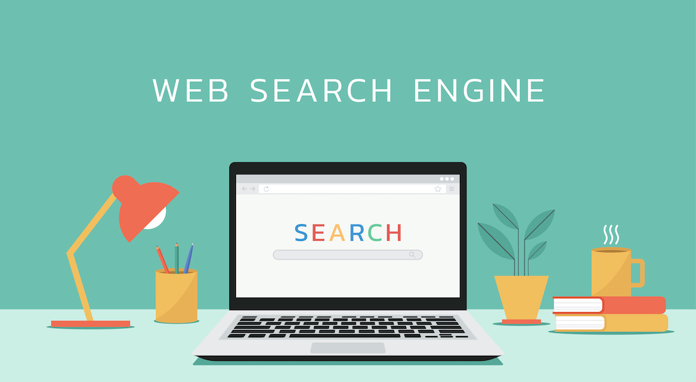

To enable collaboration and open access, 
it is recommended to manage the multidimensional media in a way
which is accessible to the team you are working with and with 
others who might benefit from the 
effort you have done to curate the data. 

There are some web-platforms which can easily allow this, such as
document management and storage system, e.g. [Microsoft Sharepoint](https://microsoft.sharepoint.com), [Google Drive](https://www.google.com)
and [Dropbox](https://www.dropbox.com/). All of this allow
for sharing capabilities with people within and beyond your organisations.

Other systems such as Virtual Research Environments are also available for
sharing data with the same community of practice. For example, those 
provided by the service [D4Science](https://services.d4science.org/).

## Making it FAIR
Emphasis shoudl be placed in following the FAIR principles
when creating multidimensional data or bringing together
existing data within a project/initative. FAIR refers to the following 
actions which should be promoted:

### Findability

{alt="findable"}

>"The first step in (re)using data is to find them. Metadata and data should be easy to find for both humans and computers. Machine-readable metadata are essential for automatic discovery of datasets and services...”
[https://www.go-fair.org/fair-principles/](https://www.go-fair.org/fair-principles/)

- Data should be linked to rich and structured metadata.

- Where possible this should be made accessible through a searchable 
resource such as an aggregation platform. 

- Data should be accessible 
through a persistent identifiers (which do not change over time). For example, [DOIs](https://www.doi.org/the-identifier/what-is-a-doi/) can be assigned to data
through platforms such as [Zenodo](https://zenodo.org/) 
or [Github](https://github.com/).

### Accessibility

{alt="access data"}

>The user "need to know how they can be accessed, possibly including authentication and authorisation". [https://www.go-fair.org/fair-principles/](https://www.go-fair.org/fair-principles/)

- Metadata should be accessible via using a *protocol* for web, such as HTTP/HTTPS
which allows to access a webpage over the browser or query a database through
a service known as *Application Programming Interface (API)*. 

- Where necessary, the protocol show allow for authentication and 
authorization to enforce data management rights.

### Interoperability 

{alt="interoperable"}

> "The data usually need to be integrated with other data. In addition, the data need to interoperate with applications or workflows for analysis, storage, and processing." [https://www.go-fair.org/fair-principles/](https://www.go-fair.org/fair-principles/)

- [IIIF](https://github.com/IIIF/awesome-iiif) (generally pronounced "triple-eye-eff") supports the interoperability of 
multidimensional media. 
- This framework allows for a link to the file, as well as
(meta)data to be accessible and easily shared.
- When implemented across many institutions overcomes 
data silos.

For example, through IIIF it is possible to [bring together objects
which physically might be in different locations]([https://projectmirador.org/embed/?iiif-content=https://iiif.io/api/cookbook/recipe/0036-composition-from-multiple-images/manifest.json]).
It does not require a user to download the files but simply to access
the files and metadata over the web.

### Reuse of digital asset

{alt="Creative common"}

> "...metadata and data should be well-described so that they can be replicated and/or combined in different settings."
[https://www.go-fair.org/fair-principles/](https://www.go-fair.org/fair-principles/)

- Multidimensional data should be 
released with a clear and accessible data usage license.

## CARE data principles

In addition, principles known as CARE focus on enhancing these
principles by leveling power relationships where data is created within
certain social and historical context. 

These principles include:
Collective Benefit, Authority to Control, Responsibility, and Ethics. 

For more information:

- Carroll, S.R., Garba, I., Figueroa-Rodríguez, O.L., Holbrook, J., Lovett, R., Materechera, S., Parsons, M., Raseroka, K., Rodriguez-Lonebear, D., Rowe, R., Sara, R., Walker, J.D., Anderson, J. and Hudson, M., 2020. The CARE Principles for Indigenous Data Governance. Data Science Journal, 19(1), p.43.DOI: [https://doi.org/10.5334/dsj-2020-043](https://doi.org/10.5334/dsj-2020-043)
- Wilkinson, M., Dumontier, M., Aalbersberg, I. et al.
The FAIR Guiding Principles for scientific data management and stewardship. Sci Data 3, 160018 (2016). [https://doi.org/10.1038/sdata.2016.18](https://doi.org/10.1038/sdata.2016.18)

