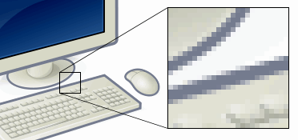
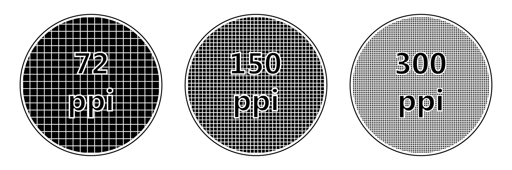
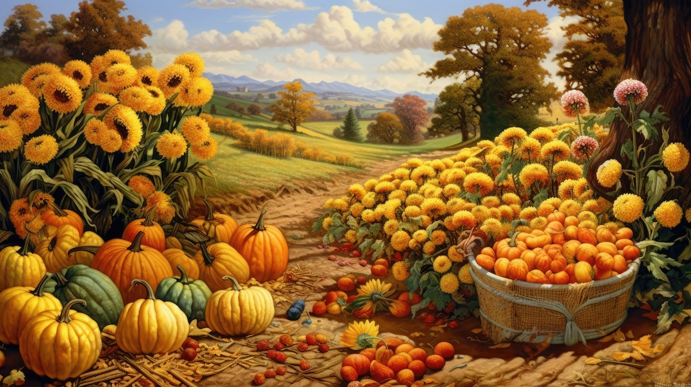
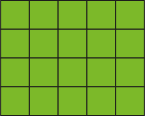
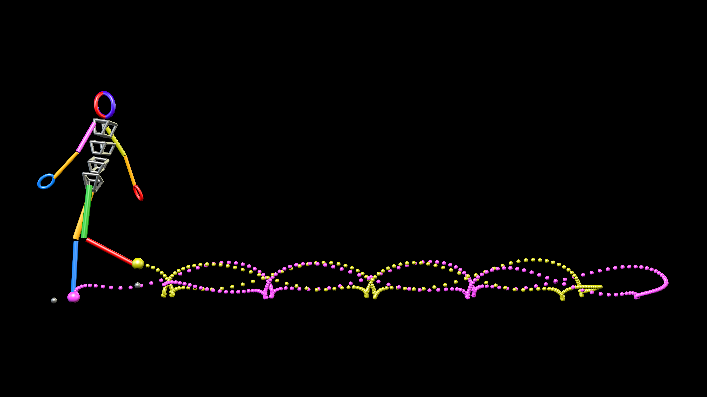

**Multidimensional** media is a term which 
covers various types of non-textual data.
It is often used to refer to 
representational and derivative media created through
digitisation processes or synthetic 
images produced via software. These processes often result in multi-part,
multi-format and, often, large 
project files which describe the creation process. 


We refer to media as **multi-dimensional**. 
This is because data experts structure information
according to the **dimensions** used to store the data
in the computer system. 

For example, the **name** of one of your friends can
be stored in a data type with **1-dimension**:

```
John Smith
```

Meanwhile, a table which stores the name of all your friends
and their addresses will use a data type similar to 
a spreadsheet table. 

```
| Name            | Address         |
|-----------------|-----------------|
| John Smith      | 34 Street Rd    |
| Marion Lopes    | 105 Babel St    |

```

The latter uses **2-dimensions**
as both rows and columns are used to organised
the data. 

## Digital Images
Data in digital images is organised similar to tables, 
as *pixels*
or *picture element*, which are the smallest element 
of an image, are organised across **2-dimensions**.
We usually refer to these dimensions as the *x*,*y* axis.

{alt="pixels"}

The **image resolution** usually refers to how many 
*pixels* an image has, either as a total or its width. 
This is why *resolution* is usually given
in *2-dimensions*, for example an image with a resolution of
*800 × 600 pixels* will have *800 pixels* across the x-axis
(its width),
and *600 pixels* across the y-axis (its height). The image will contain  
*480,000 pixels* in total.

{alt="3 pictures of a car, from a high resolution (to the left) to a low resolution (to the right)"}

Meanwhile, the **PPI** or **DPI** (**Pixels per Inch** or **Dots Per Inch**) 
attributes of images refers
to their pixel density. That is how many pixels there are in 
1 inch (2.54 cm) in the display in which the image
is *rendered* or in the printed image. 

{alt="DPI example"}

Example of digital images include digital photographs generated
by a camera sensor (e.g. on a smart phone), or synthetic
images created on directly on the computer (e.g. painting tools or generated
by Artificial Intelligence software).

{alt="photographs"}
{alt="generated"}

Given the wide-availability of camera sensors, including
on smart phones and digital cameras,
digital images are the widest available multi-dimensional media.

### Image Platforms
Collections of images are found across many website, and popular search engines
now support image-based search which allows to search digital-images
across websites given an input image. See examples:

- [Pixabay](https://pixabay.com/)
- [Adobe Stock](https://stock.adobe.com/)
- [Shutterstock](https://www.shutterstock.com/)
- [Flickr](https://www.flickr.com/)

::::::::::::::::::::::::::::::::::::: challenge 

## Challenge 1: Search for images

Save the image below and navigate in your browser to [https://www.google.com/](https://www.google.com/).
Using the camera image on the search bar, search for the image.

{alt="Peter Rabit magazine"}

::::::::::::::::::::::::::::::::::::::::::::::::

### Image Formats

Finally, images are commonly stored using formats such such as:
- *JPEG*, short for Joint Photographic Experts Group, and *PNG*
*Portable Network Graphics* formats compress
pixel information making the files size smaller.
- *TIFF*, short for Tag Image File Format, 
stores non-compressed information, making the file sizes larger.

Digital photography will make use
of other formats, such as *DNG* or *RAW* to store raw image information. 
Other software store image projects in proprietary formats, meaning files
can only be open by these.


## Digital Video

Digital video could be considered a **2-dimensional** or, even a **3-dimensional**,
type of media.

This is because a video contains many images or **frames**, which are stored
in **2-dimensions** as described above, and rendered sequentially.

{alt="frames in video"}
{alt="frames in video frog"}


Video also have a **Resolution** which is related to the images.
Resolution will be the same for all the frames in a video file.
For instance 4K video is usually made of frames which are
X x Y in resolution.

The rate at which frames are displayed is usually referred
to as **Frames Per Second** or **FPS**. For reference,
TV and movies are usually displayed at 24 FPS.

### Video Platforms
Video is also a popular type of content, as there are many platforms
on the web which allow
users to easily share their media. See examples:

- [YouTube](https://www.youtube.com)
- [Vimeo](https://vimeo.com/)
- [Wikimedia](https://commons.wikimedia.org/wiki/Category:Videos)


Note that while images can be downloaded by web browsers, 
it is not always possible to download video 
from these websites. Many times, video is only made available
through a media player.

### Video Formats
There are many formats to store video and audio, including
those supported by webpages:

- MP4 (MPEG-4) is a common *container format* which can play
in almost all devices and over the web.
- WebM and OGG are open video formats.

There are many others [formats](https://en.wikipedia.org/wiki/Video_file_format).

Note that videos with higher resolution and FPS will 
be larger and hence, challenging 
to send via email or download over the web. 

## 3D Images or Models
Before exploring what 3D images or 3D models are, 
there are some relevant concepts to cover.

:::::::::::::::::::::::::::::::::::::::::::::::::::::::::::::::::::: instructor

This exercise requires having access to blank paper and a square-grid paper.

::::::::::::::::::::::::::::::::::::::::::::::::::::::::::::::::::::::::::::::::

::::::::::::::::::::::::::::::::::::: challenge 

## Challenge 1: Drawing a 3D-cube

In a piece of blank paper, draw a 3-dimensional cube or box of dimensions:

height = 1 

width = 1  

depth = 1

::::::::::::::::::::::::::::::::::::: solution 


:::::::::::::::::::::::::::::::::

## Challenge 2: Draw it again

Now, using a square-grid paper draw again your cube or box using the 
same dimensions. In this exercise you must decide whether to fill or
not the squares of the grid to draw your 3-dimensional box.

:::::::::::::::::::::::: solution 

You have just experienced the concept of **Rasterisation**. 

This challenge illustrates the decision made by the computer
on what information to display on the screen. It must decide
whether a pixel should be drawn or not to represent the 
information of the 3D-cube you drawn.

:::::::::::::::::::::::::::::::::
::::::::::::::::::::::::::::::::::::::::::::::::


**Rasterisation** is the process 
to go from a **vector** graphics description 
into a **raster** image. In this process, we understand:

- The **vector** description allows a user to
draw primitives such
as 2D polygons, line segments and 3D shapes using 
coordinates (e.g. (1,0)) or mathematical functions.

{alt='square vector format'width=60%}
In the example above, a user can describe a 
cube using 4 coordinates: (0,0), (1,0), (1,1) and (0,1).

- The **raster image** is the pixel-based representation of the
vector description.

{alt='square raster format' width=60%}


Now that we covered these concepts, we return to the definition of
**3-dimensional** media. A **3-dimensional** image or model
normally refers to a file(s) with vector data which describes 
spatial information.
For example, 

- Points in space acquired by a sensor device such
as a 3D scanner, or 
- An architectural 3D drawing with measurements for walls and other
architectural elements.

<iframe
  name="Bamberg, Kaisersaal, 4x8k"
  src="https://kompakkt.de/viewer/index.html?entity=61f7bce9605228325f63190d&mode=open"
  allowfullscreen
  loading="lazy"
  width="100%"
  height="500px"></iframe>
&copy; [Jan Lutteroth, Corpus der brocken Deckenmalerei, Institut für Kunstgeschichte](https://kompakkt.de/entity/64181f0a07603d5bf4087497)

This type of dataset can also extend into **4-dimensions** by
also considering time. For instance, data captured
by a motion capture device will produce a vector data which changes
every time the device samples new data. We call this measure
sampling rate per second.

{alt="motion capture"}


The **vector** description allows a user to
draw primitives such
as 2D polygons, line segments and 3D shapes using 
coordinates (e.g. (1,0)) or mathematical functions.


**3D image** or model files contain **vector** information,
including:

- Points or vertices with coordinate information
- Information on how various points are connected to form
shapes such as triangles, which is known as the topology
or connectivity of the 3D model.

{alt="3D vector data"}


### 3D Model Platforms
Popular format platforms include:

- [Sketchfab](https://sketchfab.com/)
- [Tinkercad](https://www.tinkercad.com/)
- [MorphoSource](https://www.morphosource.org/)
- [Kompakkt](https://kompakkt.de/home?locale=en)
- [Smithsonian 3D](https://3d.si.edu/)
- [Open Heritage 3D](https://openheritage3d.org/ )
- [Visual Media Service](https://visual.ariadne-infrastructure.eu/)

As with video, the *viewers* for **3D models* normally allow
to visualise and interact with the information. But not always
does it allow to download the file.

### 3D Model Formats
There are many file formats for **3D images** or **models** 
including:

- GLTF (JSON/ASCII) or GLB (binary) is the standard 
Graphics Library Transmission Format which is commonly used for **3D models**
on the web.
- OBJ, USD and PLY are popular format for 3D data which support 
additional information, such as textures or colour.
- STL is a popular format in 3D printing and rapid prototyping.

Other proprietary formats such as FBX and 3DS will contain
vector information on scenes.

The number of points/vertices or triangles are used 
to determine the resolution of the 3D model. Note that, 
as with images and video,
**3D models** that have a larger number of vertices, for example,
over 100,000 will have a larger size. This has an impact
on how long it takes to download, load or *render* this content.
 
## Gathering Multidimensional Files

Great variety of multidimensional content is available through
the various platforms for 
research, education, entertainment and storytelling among
other applications. 

Some aggregator websites offer access to a variety of visual 
content, including:

- [Europeana Platform](https://www.europeana.eu/en)
- [Wikimedia Commons](https://commons.wikimedia.org/wiki/Category:Images)


Some general advice when looking for content
for your projects include:

1. **Download the multimedia file** where possible and store locally or on the 
repository where you are curating the dataset. 
2. Use the **maximum resolution possible**. It is always possible to reduce the number of pixels, but not to increase them.
3. **Record basic metadata** about the file,
including the reference and copyright to the image. 
If you are doing 
additional research look at data models, such as [Dublin-CORE cross domain set](https://www.dublincore.org/specifications/dublin-core/cross-domain-attribute/),
which contains useful information to store, including:
  - Title
  - Subject
  - Description
  - Date
  - Resource Type
  - Format
  - Resource Identifier
  - Language 
  - Rights Management

This will
become useful information to provide later as part of the data set.
4. Use a suitable file name to keep easy track of the media and its provenance.
If the file it is too large, it is possible to resize and save again in 
medium and low quality.

For example:

```
		WebsiteFromWhereFileWasDownloaded_ResourceID_[high|medium|low].[format] 
```

This will become:

```
    Flick_photo1234_high.png
    Flick_photo1234_medium.png
    Flick_photo1234_low.png
```
    
  
