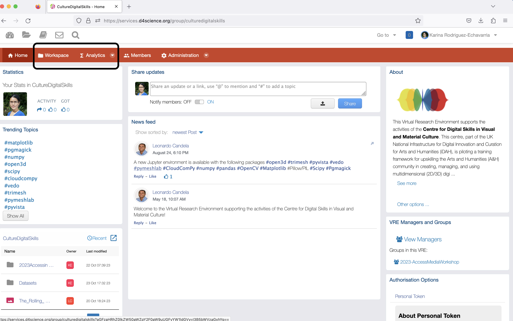

## D4Science infrastructure 

Virtual Research Environments make it easy for teams across
organisations to collaborate in data-driven research process.

For example, a project that you are developing with friends/colleagues
might involve investigating how it was living in Brighton 
in the 18th century. You might be using this to recreate
visually a scene in the city.

Visual information can make it easier to develop
the project, and it can also be more engaging
for users to feedback on
early prototypes. 

Information can include:

- Mapping the geographical areas which were inhabited in Brighton
as well as any roads.
- What architecture did larger and smaller buildings had?
- How did people dress?
- What activities they did?

To enable collaboration and support FAIR principles,
Virtual Research Environments (VRE) can be useful.
VREs are collaborative environments created 
on-demand allowing remote sharing of applications, 
services and data resources.

We will make use of [D4Science](https://services.d4science.org/group/culturedigitalskills)
to explore further these environments.

Either click on the link or copy/paste to your browser the address: [https://services.d4science.org/group/d4science-services-gateway/explore](https://services.d4science.org/group/d4science-services-gateway/explore). 

Login by 
using your existing login details of some computing networks, e.g. 
the one of your institution or your google account.

:::::::::: challenge

## Geting authorisation: Login to the VRE

If you have never logged in before, you will need to follow a few steps:

1. Accept the Terms and Conditions.

2. Select to join the 'CultureDigitalSkills' project. 

3. Click on request to join CultureDigitalSkills VRE and  
 wait for approval from the administrator.
 
4. Once you have received an email of approval, logout and in again 
if you have any issues accessing the VRE.

:::::::::: solution

You will see the main interface upon successful login.
See below.

::::::::::::::::::::::::::::::::::::::::::::::::
::::::::::::::::::::::::::::::::::::::::::::::::

In the main interface, you should be able to see a 
menu bar at the top showing a **Workspace** and an **Analytics**
menu item.

{alt="main interfacce of VRE"}

Click on **Workspace**.

## Workspace 
Shared data amogst the community is stored in a secure workspace.
This allows for on-line file sharing across organisations.

## VRE Analytics
VREs also provide access to 
an interactive development environment for notebooks, code, and data.
This aims to support basic editing of text-data and the implementation of 
data processing algorithms using high-performance backend computers.

For this, the VRE provides access to a [**JupyterLab** enviornment](https://jupyter.org/).

Jupyter supports over 40 programming languages, 
including Python, Java, R, Julia, and Scala. 

Common actions 

Upload

Common actions - menu

Edit
